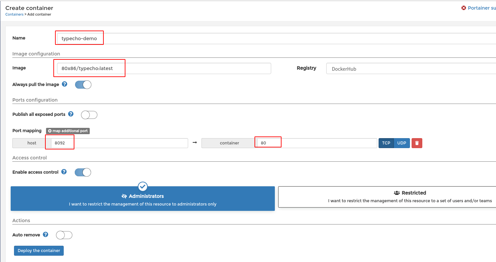
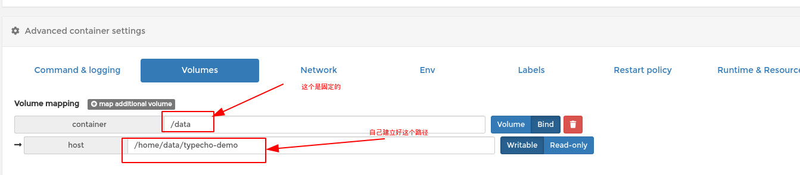
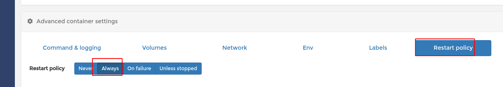

> 原文由 @也无荒野也无灯 发表于 2019-05-08 20:14

> 原文地址（已经不可访问): `http://nanodm.net:8092/archives/3/`

如何升级到现在的版本？
直接recreate并pull镜像重建容器.

docker 镜像地址，欢迎star: https://hub.docker.com/r/80x86/typecho

打开docker UI,
Image填写： `80x86/typecho:latest`

映射好80端口

映射好 `/data` 目录用于存储文档 （bind模式）

Restart policy: Always

最后： deploy 

搞定。

