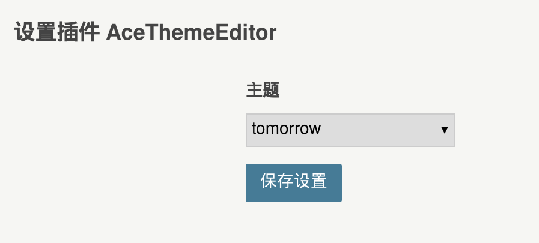
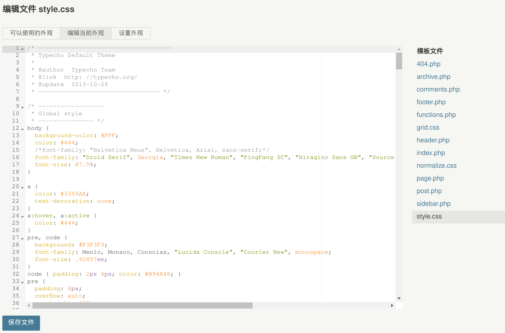
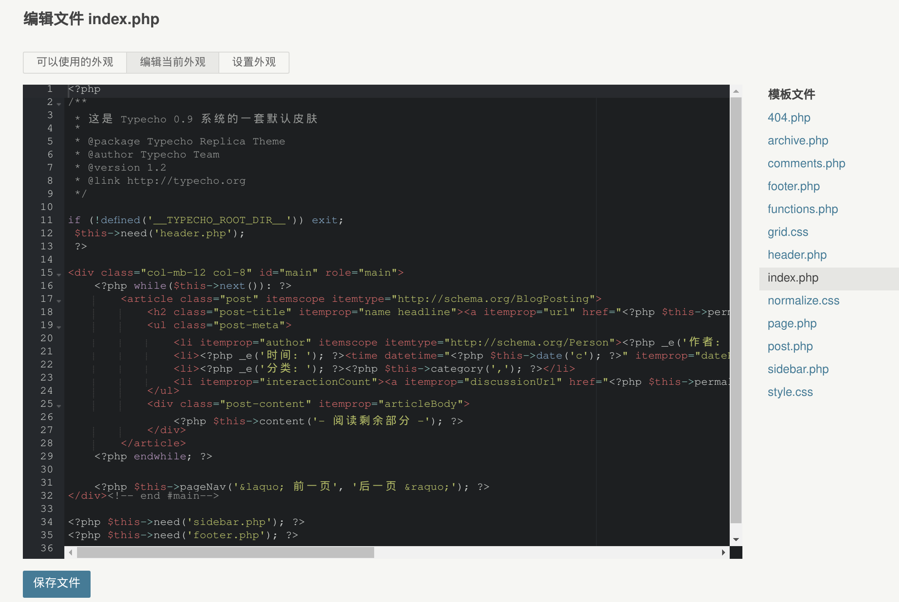
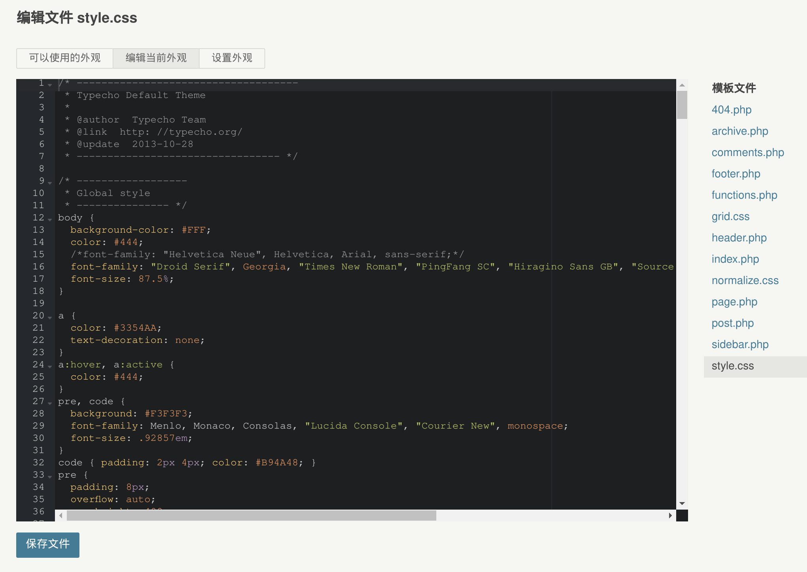

> 原文由 @也无荒野也无灯 发表于 May 8, 2019

> 原文地址（已经不可访问): `http://nanodm.net:8092/archives/1/`


dockerhub地址：
> https://hub.docker.com/r/80x86/typecho


20190511 更新：
更新方法：docker ui选择recreate 并勾选 pull image 即可更新到最新版。
新增加 Ace Theme Editor 插件用于主题编辑界面的代码高亮显示。
支持几十种配色。
此插件默认没启用，需要的自行启用即可。

```ini
ambiance
chaos
chrome
clouds
clouds_midnight
cobalt
crimson_editor
dawn
dracula
dreamweaver
eclipse
github
gob
gruvbox
idle_fingers
iplastic
katzenmilch
kr_theme
kuroir
merbivore
merbivore_soft
mono_industrial
monokai
pastel_on_dark
solarized_dark
solarized_light
sqlserver
terminal
textmate
tomorrow
tomorrow_night
tomorrow_night_blue
tomorrow_night_bright
tomorrow_night_eighties
twilight
vibrant_ink
xcode
```











另外，有人反馈`sagiri`主题侧边栏的`archive`和`category`分类链接无法正常显示，这个不是问题。
按主题说明自己设置即可修复：https://github.com/shiyiya/typecho-theme-sagiri

20190509 更新：
修复了ddns远程访问时主题资源还是调用了内网IP的问题
nginx和php7的日志文件默认放到数据目录下的log目录下，方便查看.
新增加APP_DEBUG docker 环境变量，设置成true 可以查看和调试PHP错误信息.
修复文章中插入图片是局域网http链接的问题.
(移除原有的带http的URL， 采用绝对路径的方式。现在无论是ddns访问添加图片，查看图片，还是内网访问，都不会存在问题了)

20190508 22:35 更新：
修复 config.inc.php 文件无法持久保存的 bug. 目前经老灯测试已经完美工作.
HTTPS功能，有空再加吧。大家先测试反馈.

