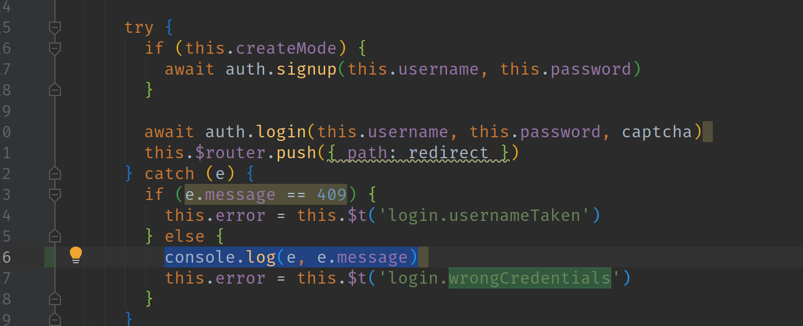

注：此文章为NanoDM站点建立之后从老灯的微信公众号用[pandoc](https://pandoc.org/MANUAL.html)导出生成:
```bash
pandoc -f html -t markdown_github-raw_html-native_divs-native_spans 为什么filebrowser用户名和密码都正确却无法登录成功.html
```

--------------------------------------------------

@author: 荒野无灯

@date:  Monday, April 8, 2019  

--------------------------------------------------

  

该群友反馈(有gif截图)，重新刷机，用默认的用户名admin 和密码 admin
登录，也提示 用户名或密码错误

首先，这是一个中文语言的翻译错误。

Wrong credentials 应该翻译成 错误的凭据

在filebrowser里，这个凭据指的是，jwt token.

  

我的确不相信这是一个bug.
但是这位朋友在群里问了几天了，且确实是尝试了很多次，包括重新刷机。

于是我给他远程看了一下，首先删除fb
的db文件，让它重新生成默认用户，然后再尝试登录，发现确实是提示 用户名或密码错误

然后我检查了下这位朋友的N1的系统时间，没错，NTP没能成功同步，系统时间还停留在2017年，如下图：


  

然后我大概知道了问题的所在。就是N1的系统时间不对导致的。

然后我问了下他用的是什么宽带，答曰：移动宽带。

好吧，难怪，系统自带的4个ntp服务器，一个也连接不上。。。Orz.

  

那么，为什么服务端的时间不对，对导致  用户名或密码错误 ？

我们知道，jwt
token里面是带有时间戳标记的，但是，如果服务器本身的时间是错误的，它在校验的时候，由于起始时间是相同的，

也不应该会过期的。即，比如现在的时间是2017年1月1日，如果用户登录成功，那么过期日期假设是2017年1月2号，这也不应该马上过期啊，

而是应该等一天之后啊。

  

于是我打开了fb的源码，主要问题感觉出现在前端，因为我们用curl请求，发现用正确的用户名和密码可以正常返回token:
```bash
curl -k -H "Content-Type:application/json" -X POST -d '{"username":"admin","password":"admin","recaptcha":""}'  https://192.168.8.201:8082/api/login
```


  

然后，老灯觉得可能是前端判断的问题。于是看了下登录相关的vue源码：



加了句打印日志代码，重新编译生成程序后，运行，然后到console看下：


  

没错，页面上是显示 Wrong credentials

但是控制台我们得到了真正的错误：token expired

我们继续看这个错误是在哪里抛出的。

在 frontend/src/utils/auth.js 中我们看到如下方法：

```javascript
export function parseToken (token) {
  const parts = token.split('.')

  if (parts.length !== 3) {
    throw new Error('token malformed')
  }

  const data = JSON.parse(Base64.decode(parts[1]))

  if (Math.round(new Date().getTime() / 1000) > data.exp) {
    throw new Error('token expired')
  }

  localStorage.setItem('jwt', token)
  store.commit('setJWT', token)
  store.commit('setUser', data.user)
}
```

没错，js进行了判断。

把用户浏览器获取到的时间戳（`Math.round(new Date().getTime() / 1000)`） 和
服务器端返回的过期时间戳（`data.exp`） 进行了一个对比。

由于我们浏览器时间是正常的2019年，而N1里返回的exp字段是2017年的，很明显，这是过期的。。。

因此 `throw new Error('token expired')`
  

这算不算一个bug呢？依老灯来说，不算。系统时间不对，这是使用者网络的问题，应该切换ntp服务器使系统时间回归正常。

但是，有两点老灯觉得可以fb可以改进一下的：

1\. 返回的提示信息要更详细一些，如 token expired  就不要粗暴地提示 Wrong
credentials

2\. 既然jwt
token的生成和校验都是在服务端，客户端其实没必要多此一举地去再次校验token

  

欢迎关注老灯的微信公众号：路由器的那些事儿  （iproute2)


-- EOF
