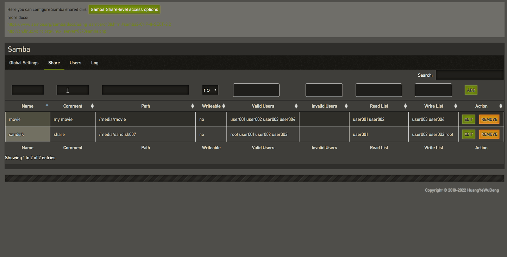
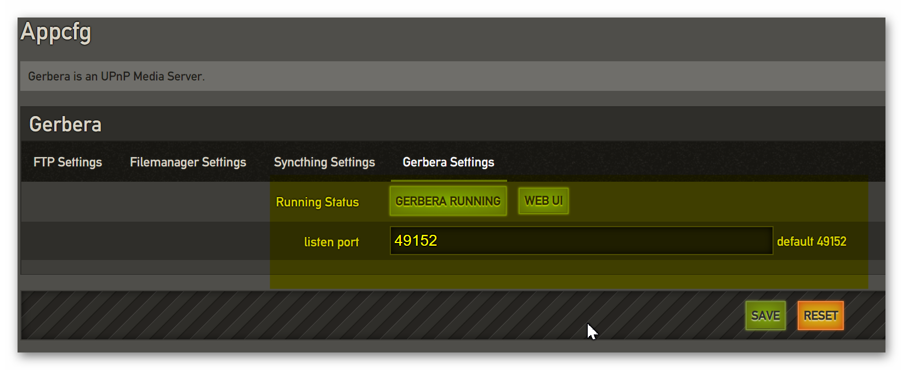
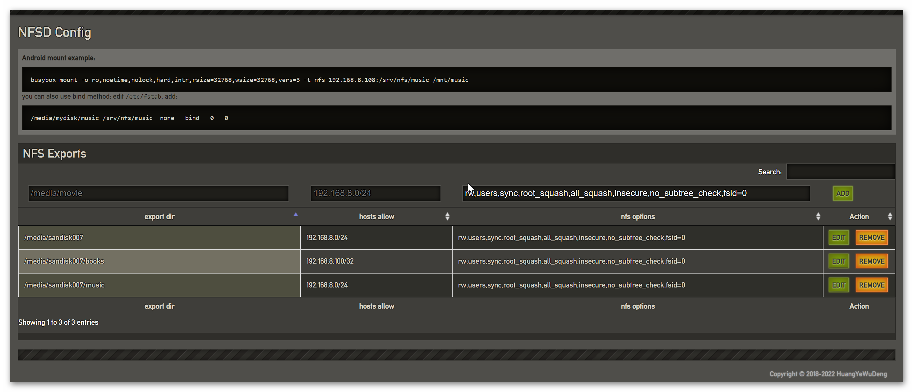
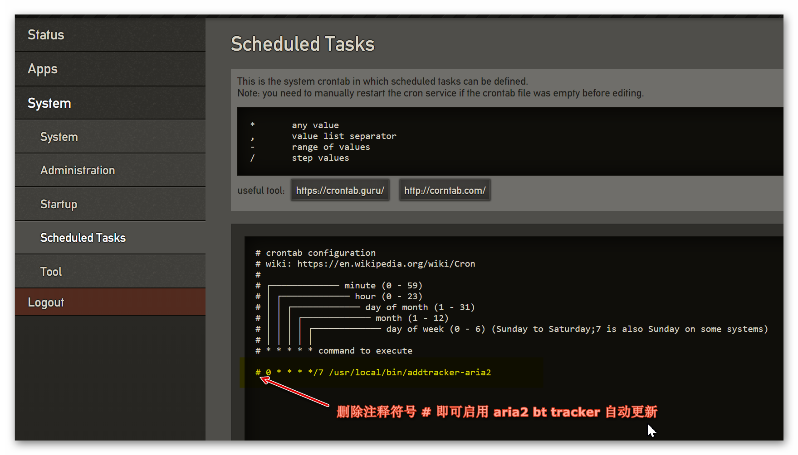

注：此文章为NanoDM站点建立之后从老灯的微信公众号用[pandoc](https://pandoc.org/MANUAL.html)导出生成:

```bash
pandoc -f html -t markdown_github-raw_html-native_divs-native_spans-hard_line_breaks-styles 'N1 PT下载小钢炮固件 20190318更新日志'
```


--------------------------------------------------

@author: 荒野无灯

@date: 3/18/2019 03:12:47  

--------------------------------------------------

  

上一次稳定版本的发布是： 20180909

  

没错，如果你看我的文章，上面截图显示的是0317的版本。

这是因为发布0317测试版之后，又发现了一个bug,
修复之后，已经是18号1点多了。


status 页面： IPv6 IP 已经可以显示了
--------------------------------------


  

dashboard 增强登录安全
------------------------

增加失败登录日志 和 拦截功能。

如果同一个IP连续登录失败超过5次，则该IP会被锁定登录1小时（即1小时之内不能再登录）


dashboad log里也有相关失败登录的信息，比如IP地址，失败次数：


  

磁盘管理优化
--------------

1.增加S.M.A.R.T信息查看按钮

2.
如果磁盘没有label,则默认按UUID挂载，可避免挂载超过两个磁盘时重启后发生sda
变成sdb, sdb变成sda的问题。

不过UUID没那么好看，强烈建议自己设置为有意义的label, 比如放电影的取名
movie ...

3\. 格式化 和自动分区功能： 不再默认设置label,
优化参数。最小化保留空间（只1%）和采用大文件的inode配置，可以节省更多的空间用来存放资源了。

4\. 增加LVM支持（暂未做 WEB UI)

5\. 增加cifs 组件( mount.cifs ) 用于挂载windows 共享

6\. 如果是挂载的ntfs系统且有dirty标识 ，则访问此页面时会尝试修复


  

aria2优化
----------

1\. 保存配置时检测下载目录是否存在，不存在则提示。

2\. rpc secret 更改之后，再打开web ui界面，不再需要点击 reset
即可自动重新连接上rpc.


  

增加同步登录功能
------------------

在登录了dashboard的情况下，点击打开qBittorrent, Aria2, Filemanager 和
Gerbera , 可实现同步登录.

也就是不再需要单独输入密码登录 。

这是懒人专用功能。也是老灯很喜欢使用的一个功能。

当然，实现这个功能，费了好些功夫的.

( transmission 由于是采用古老的http
basic认证，同步登录的接口不好搞。暂不能同步登录。)


  

  

修复tr 在frp穿透之后无法正常访问的问题
--------------------------------------

通过frp的域名文中tr时，连接rpc会有 401错误，在新版本中，解决办法有两个：

1\. 禁用rpc host whitelist enabled 选项

2\. 启用rpc host whitelist enabled，但是 rpc host whitelist
处添加你的frp的域名，支持泛域名（多个域名用英文半解逗号分隔)

  


  

Samba共享目录配置优化
---------------------

1\. 点击  Samba Share-level access options 按钮可以查看 Valid Users
等选项分别表示什么意思

2\. Valid Users 等选项不再需要手动填写，直接点击选取

(注意：！！！ Name 字段必须唯一 )



  

SAMBA用户管理

从旧备份配置恢复的配置，由于smb里存在用户，但是对应的系统用户已经不存在了，这在以前的版本中会导致无法删除这个用户。

现在的版本已经修复了。


---------------------------------------------------------------------

  

NTP设置优化
-----------

1.增加NTP同步状态显示

2\. 增加显示 国家授时中心标准时间, N1系统时间,
用户电脑时间(仅作参考，有些用户的电脑时间是不准确的）

如果你发现 国家授时中心标准时间 和N1系统时间没有同步且相差很多，可以点击
强制同步恢复时间。

  


  

新增加UPNP/DLNA 协议支持
------------------------

此协议由Gerbera支持，原来打算是用miniDNLA的，这个代码太老了，也没人维护。看Gerbera最近开始活跃，且自带简洁的web
ui,挺好的。

初步集成，还没有做配置界面（下图中的端口号配置也是不生效的）

另外 ，如果中文显示成问号 ? , 可在后台Startup 处重启一次 S99gerbera
临时解决.




  

新增加简易NFS server 配置界面
-----------------------------

如下图，nfs options默认填写好了，如果不想改直接用默认的就行.



  

应用配置调整
--------------

  

aria2 增加磁盘缓存选项：


  

计划任务默认有aria2
tracker自动更新的配置，只需要删除注释符号\#即可启用,如下图：



  

samba: 增加ntlm auth 选项，设置成yes
可解决部分电视盒子的老系统无法通过smb连接上的问题


  

ftp: 

增加被动连接的最小和最大端口配置

增加pasv\_promiscuous 选项


 

系统改进：
----------

### 1. daemon默认创建的文件group权限修复,方便不同应用共享数据

 daemon默认的umask修复(000)

smb默认创建的文件默认777

<https://gitee.com/8ox86/phicomm-n1-issue/issues/IMB69>

  

### 2. fb 文件管理器优化

全局选项：增加新建用户时自动创建家目录的选项.
如新建用户huangye,则创建并限制于默认家目录./users/huangye
前端：修复没有权限删除文件时不能正确报异常信息的bug.

修复部分不规范的ass字幕无法转换成功的bug.

修复utf16le和gbk字幕无法成功转换成utf8的bug.

1.  自动加载vtt代码优化。

    自动转换srt 或 ass 字幕为 vtt 字幕并自动加载.

    自动转换gbk 字幕为utf-8

如果目录下有 `foo.mp4` 文件，则字幕将按以下搜索顺序自动加载：

```
foo.chs.vtt
foo.vtt
foo.cht.vtt
foo.en.vtt
```

如果没有找到vtt字幕，则会尝试按以下搜索顺序自动转换并加载字幕：

```
foo.chs.srt
foo.简体.srt
foo.srt
foo.cht.srt
foo.繁体.srt
foo.en.srt
```

如果srt字幕没有找到，则会继续用类似的方法，尝试 ass 字幕.

1.  全局选项：增加视频和音乐自动播放选项.

2.  分享页面：去除不必要的UI元素。干净。

3.  增加“已分享链接”管理页面.

4.  其它优化。

  

### 3. entware支持

如果想要从entware安装软件，可：

1.  编辑 /etc/opkg/entware.conf 取消行首的 \# 符号

2.  opkg2 update

3.  查找包 opkg2 find xxxx

4.   opkg2 install xxxxx

      

如果需要支持服务自启动，需要：

Add /opt/bin & /opt/sbin to your PATH variable

Add '/opt/etc/init.d/rc.unslung start' to startup script for Entware
services to start  

  

4\. 硬盘休眠：增加hdparm (未做配置功能）

5\. qb 升级到4.1.5 , libtorrent-rasterbar 更新到 1.1.12

种子上传界面优化，只显示.torrent 后缀的文件.

6\. tmux默认配置优化，兼容screen快捷键 (oh my tmux)

7\. transmission增加skiphashcheck功能

有群友表示：这个功能在多个PT站做种或辅种时比较方便，不然一个太大的文件做种前要hash很长时间，qb是有这项功能，但是个别站不支持qb，只能选择tr了。

使用方法：

In the web interface: `http://ip:9091/transmission/web/`. right click on
ANY torrent, click `Ask tracker for more peers` and the CURRENT
verifying torrent will be skipped for hash check.

8\. kernel: ftp: 关闭烦人的 IPVS: Creating netns size=1408 id=257 日志

9\. 增加qb和tr的最大打开文件数量到 16384  （以前是1024)

10\. 增加avahi (zeroconf 的linux实现）, LVM2

11\. ROOTFS由原来的300M 改变为 600M(方便有些人只想使用U盘用一下)

12\. frp 和 syncthing 升级到最新版

13\. cfg-recovery: 不再复制原系统的用户名和密码,
因此升级固件后，还原了配置，注意重新设置一下root的密码

  

bug 修复：
----------

1.fix 启用nfs服务后无法备份配置

<https://gitee.com/8ox86/phicomm-n1-issue/issues/IN28R>

2\. qb 等红种问题解决（由于qb先于磁盘挂载启动导致）  

若发现下载目录不存在，则延时60秒再启动qb或tr。

3\. 修复 S.M.A.R.T 信息在2K屏下显示超出了的问题

  

还有其它一些东西可以暂时没想起来，这次更新的东西实在太多了.

如有bug 还请及时反馈给老灯.

所有的这些更新只是为了让固件更好用，希望大家喜欢。

  

欢迎关注老灯的微信公众号：路由器的那些事儿  （iproute2)


  

-- EOF
